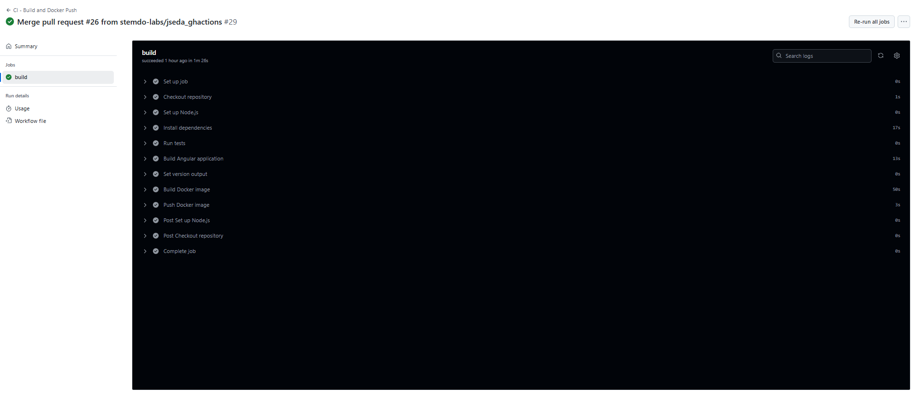
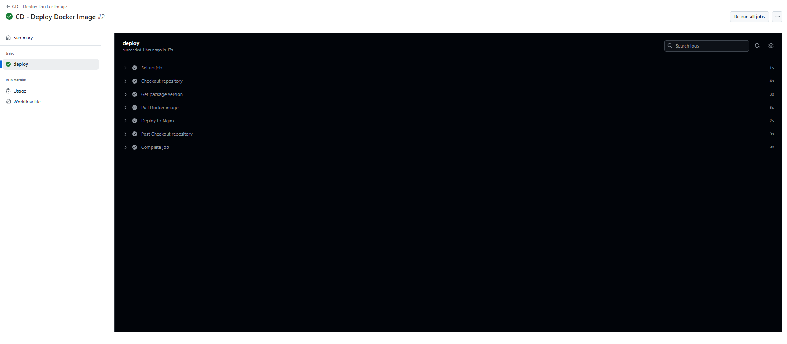

# Ejercicios de Github Actions  para iniciarse en el Mundo de DevOps

¡Bienvenido/a al ejercicio semanal de Github Actions para iniciarse en el mundo de DevOps!

## Descripción

Este ejercicio tiene como objetivo introducirte al uso práctico de GitHub Actions en un entorno de CI/CD. CI/CD es un conjunto de prácticas que son fundamentales en el desarrollo de software moderno, especialmente en DevOps. Estas prácticas permiten una mayor agilidad, colaboración y calidad en el ciclo de vida del software, facilitando la entrega continua de nuevas funcionalidades y mejoras sin interrupciones importantes.

En un entorno DevOps, CI/CD se convierte en el puente que une el desarrollo y las operaciones, proporcionando a los equipos una plataforma donde pueden colaborar de manera fluida y eficiente. La Integración Continua (CI) garantiza que los desarrolladores puedan integrar su código de manera frecuente y segura en un repositorio central, donde se validan automáticamente los cambios mediante pruebas y builds. Esto ayuda a detectar errores lo antes posible y a mantener la calidad del código a medida que el proyecto crece.

Por otro lado, el Despliegue Continuo (CD) permite automatizar el proceso de entrega de software, asegurando que cada versión que pase las pruebas pueda ser desplegada de manera rápida y sin intervención manual. Esto reduce el tiempo de comercialización y mejora la fiabilidad del software, lo que es esencial en proyectos que necesitan ser escalables, seguros y robustos.

Durante este ejercicio, trabajarás con un proyecto básico de Angular, donde crearás los workflows necesarios para realizar el build, test y despliegue de la aplicación, integrando estos procesos automatizados en un pipeline de CI/CD.

## Objetivos

El propósito principal de este ejercicio es _proporcionarte una introducción práctica a los conceptos de Github Actions_ que son esenciales para cualquier persona interesada en trabajar en el área de DevOps. Al completar estos ejercicios, esperamos que adquieras experiencia práctica con:

- Creación de **workflows** en GitHub Actions.
- Uso de **Actions** personalizadas.
- Trabajo con **workflows reutilizables**.
- Manejo de **Secrets**

## Estructura del Repositorio

Este repositorio contiene una aplicación de Angular. Deberás diseñar dos workflows clave:
1. **Workflow de Integración Continua (CI)**: Se encargará de construir la aplicación, crear una imagen Docker y subirla a un registry (DockerHub).
2. **Workflow de Despliegue Continuo (CD)**: Tomará la imagen del registry, la desplegará y verificará que esté corriendo correctamente simulando una llamada a través de `curl` a la página HTML servida por **nginx**.


### Requisitos Técnicos
Asegúrate de cumplir con los siguientes requerimientos:

1. **Triggers**: Configura correctamente los triggers, de forma que los workflows se ejecuten automáticamente en las condiciones necesarias.
   
2. **Workflows reutilizables**: Debes investigar y utilizar al menos un workflow reutilizable para no repetir código innecesario.

3. **Custom Actions**: Crea Actions personalizadas utilizando el tipo `composite` para una tareas específicas, como taggear la imagen antes de subirla a DockerHub, tal como se explica a continuación poseriormente.

4. **Variables y Secrets**:
   - Usa **variables de entorno** y **secrets** para gestionar información sensible como credenciales del Docker registry.
   - Diferencia entre entornos de **producción** y **uat** utilizando estas variables.

5. **Tests y cobertura de código**:
   - Debes crear un **job** para simular la ejecución de tests de cobertura de código. Este job debe ejecutarse solo cuando el entorno es de **producción**.
   - Si el entorno es **uat**, los tests no deben ejecutarse.


### Custom Actions: Taggear la Imagen Docker

Uno de los objetivos del ejercicio es que crees una custom action de tipo composite para etiquetar (taggear) la imagen Docker antes de subirla al registry de DockerHub. La versión de la imagen será extraída dinámicamente del archivo package.json que se encuentra en el proyecto Angular del repositorio.

#### Especificaciones de la Custom Action:

1. **Entradas**:
    - `image_name`: El nombre de la imagen Docker (por ejemplo, `mi-app-angular`).
    - `version`: La versión de la imagen, que será extraída del archivo `package.json` del proyecto Angular. Debes leer el valor del campo "version" en este archivo y utilizarlo para etiquetar la imagen.

2. **Salida**:
    - La custom action debe devolver el nombre completo de la imagen etiquetada.

#### Implementación:

- Utilizarás esta custom action que vas a crear para obtener la etiqueta de la imagen en tu **workflow de CI**, justo antes de hacerl el build y subir la imagen a DockerHub.

#### Aclaraciones

Es muy importante que actualices manualmente la versión en el archivo package.json cada vez que quieras generar una nueva imagen Docker.

El campo "version" del archivo package.json es el que se usará para etiquetar la imagen Docker. Si no actualizas este campo antes de crear una nueva imagen, es posible que la imagen anterior sea sobreescrita (pisada) en el registry de DockerHub. Para evitar esto, debes:

- Abrir el archivo package.json en el proyecto Angular.
- Actualizar el valor del campo "version" (por ejemplo, de "1.0.0" a "1.0.1", "1.1.0", etc.).

## Contribución

¡Tus contribuciones son bienvenidas! Si tienes ideas para nuevos ejercicios o mejoras para los existentes, no dudes en abrir un issue o abrir un pull request.

# Solución
## Que hacen cada uno de los workflows
### CI - Build and Docker Push `ci.yaml`
Este flujo de trabajo se activa automáticamente cuando se hace push a la rama main. Sus pasos son:

1. Clona el repositorio.
2. Configura Node.js versión 18.
3. Instala dependencias con npm install.
4. Ejecuta tests .
5. Compila la app Angular en modo producción (npm run build --prod).
6. Obtiene la versión de la app desde package.json y la guarda como output.
7. Construye la imagen Docker con etiqueta: DOCKER_USERNAME/mi-app-angular:<versión>.
8. Publica la imagen en Docker Hub, usando credenciales almacenadas como vars.

Este workflow no despliega, solo construye y sube la imagen a Docker Hub.<br>

````yml
name: CI - Build and Docker Push

on:
  push:
    branches:
      - main

jobs:
  build:
    runs-on: ubuntu-latest
    outputs:
      version: ${{ steps.set-version.outputs.version }}
    steps:
      - name: Checkout repository
        uses: actions/checkout@v2

      - name: Set up Node.js
        uses: actions/setup-node@v2
        with:
          node-version: '18'

      - name: Install dependencies
        run: npm install

      - name: Run tests
        run: echo 'npm test'

      - name: Build Angular application
        run: npm run build --prod

      - name: Set version output
        id: set-version
        run: echo "version=$(node -p "require('./package.json').version")" >> $GITHUB_OUTPUT

      - name: Build Docker image
        run: |
          docker build -t ${{ vars.DOCKER_USERNAME }}/mi-app-angular:${{ steps.set-version.outputs.version }} .

      - name: Push Docker image
        run: |
          echo "${{ vars.DOCKER_PASSWORD }}" | docker login -u ${{ vars.DOCKER_USERNAME }} --password-stdin
          docker push ${{ vars.DOCKER_USERNAME }}/mi-app-angular:${{ steps.set-version.outputs.version }}
````
<br><br>

### CD - Deploy Docker Image `cd.yaml`

Este segundo flujo se activa automáticamente después de que el workflow CI haya terminado correctamente, gracias a workflow_run.

1. Clona el repositorio.
2. Obtiene la versión de la app leyendo package.json.
3. Descarga la imagen desde Docker Hub: DOCKER_USERNAME/mi-app-angular:<versión>.
4. Ejecuta un contenedor en segundo plano con Nginx en el puerto 8080, sirviendo la app compilada.
5. Hace una petición curl al contenedor para verificar que responde correctamente.

Este flujo representa la fase de despliegue (CD).<br>

````yml
name: CD - Deploy Docker Image

on:
  workflow_run:
    workflows: ["CI - Build and Docker Push"]
    types:
      - completed

jobs:
  deploy:
    if: ${{ github.event.workflow_run.conclusion == 'success' }}
    runs-on: ubuntu-latest
    steps:
      - name: Checkout repository
        uses: actions/checkout@v2

      - name: Get package version
        id: version
        run: echo "VERSION=$(node -p "require('./package.json').version")" >> $GITHUB_ENV

      - name: Pull Docker image
        run: |
          docker pull ${{ vars.DOCKER_USERNAME }}/mi-app-angular:$VERSION

      - name: Deploy to Nginx
        run: |
          docker run -d -p 8080:8080 ${{ vars.DOCKER_USERNAME }}/mi-app-angular:$VERSION
          curl -f http://localhost:8080 || exit 1
````
<br><br>

### Usuario y contraseña de Docker

- Se utilizan variables (`vars`) del repositorio llamadas `DOCKER_USERNAME` y `DOCKER_PASSWORD`. Que tenemos que definirlas en Settings -> Secrets and variables -> Actions -> Variables -> New repository variable
- Estas se utilizan para el login a Docker Hub (en CI) y para referenciar la imagen en CD.